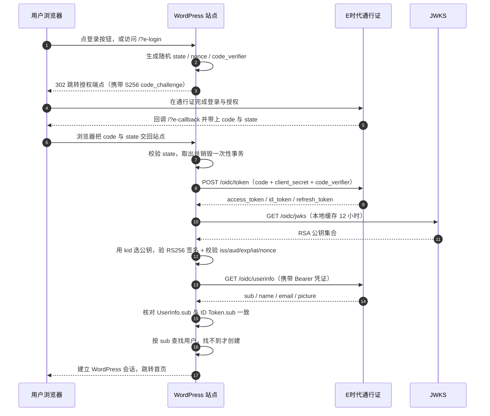

# E时代通行证 · WordPress 登录插件

**用「E时代通行证」一键登录你的 WordPress 站点**

---

## 这是什么

一个把 **E时代通行证** 接入 WordPress 的单文件插件。用户在登录页点一下，就能用通行证账号登录你的站点——不用记新密码，也不用你维护一套额外的账号体系。

已按 **《E时代通行证 OIDC 接入文档 v2.0》** 实现，采用 **OAuth 2.0 Authorization Code Flow + S256 PKCE + RS256 ID Token（JWKS 验签）**。

> 旧版 OAuth2 与已登记的 HS256 客户端仍被服务方兼容，但**新接入请一律使用本插件的默认配置**。

## 特性

- **标准 OIDC 接入**：Authorization Code Flow，`scope=openid profile email`
- **完整的身份认证**：本地验签 ID Token 后才建立会话，不盲信任何返回
- **S256 PKCE**：每次授权独立的 `code_verifier` / `code_challenge`，只存在服务端
- **state + nonce 双防**：防 CSRF、防重放，一次性事务 600 秒过期
- **零依赖**：单文件、无 composer、无第三方 SDK，拷进去就能用
- **Discovery 自适配**：端点运行时从 `.well-known` 读取并缓存 24 小时，读取失败自动回退内置常量
- **后台连通性自检**：一眼看清端点、JWKS 密钥、`openssl` 状态
- **老站点平滑升级**：兼容 v1.x 的账号绑定记录，已有用户不会变成新账号

## 环境要求

| 要求 | 说明 |
| --- | --- |
| WordPress | 5.5 或更高 |
| PHP | 7.4 或更高 |
| **`openssl` 扩展** | **必需**。RS256 验签依赖它；未启用时插件会在后台告警并阻止登录 |

> Laravel / 宝塔 / 大多数虚拟主机默认已开启 `openssl`。若自检面板显示未启用，请在 `php.ini` 中取消 `;extension=openssl` 的注释并重启 PHP。

## 安装

**方式一：上传安装包（推荐）**

1. 到 [Releases](https://github.com/MarkITwains/Emoera-OAuth2.0-WordPress/releases/latest) 下载 `emoera-openid.zip`；
2. 进入后台 **插件 → 安装插件 → 上传插件**，选择该 zip 安装；
3. 启用「E时代通行证」。

**方式二：手动放置**

把仓库里的 `emoera-openid` 文件夹整个复制到站点的 `wp-content/plugins/` 目录，再到 **插件** 列表启用。

> ⚠️ WordPress 要求安装包的根目录下**只有一个插件文件夹**。仓库源码自动打包出来的 zip 里还带着 `README.md`、`LICENSE`、`assets/`，**不能**直接用于后台安装——请使用上面 Releases 里的发布包。

**安装完成后**

1. 左侧菜单出现 **E时代通行证**，进入并填写配置（见下一节）；
2. 把页面里显示的 **回调地址** 提交给通行证服务方登记；
3. 退出登录，在登录页点「使用E时代通行证登录」实测一次。

## 配置

进入后台 **E时代通行证** 菜单：

| 配置项 | 必填 | 说明 |
| --- | :---: | --- |
| Client ID | ✅ | 服务方分配的客户端 ID |
| Client Secret | ✅ | 服务方分配的客户端密钥。仅在后端使用，用于 Token 交换（`client_secret_post`）与 HS256 验签 |
| 回调地址 (Redirect URI) | — | 只读，固定为 `https://你的站点/?e-callback`，需原样提交给服务方登记 |
| 启用 PKCE (S256) | — | **默认开启**。规范的推荐做法。若服务方尚未为该客户端启用 PKCE 导致授权报错，可临时关闭 |
| ID Token 预期签名算法 | — | `RS256`（默认，JWKS 公钥验签）/ `HS256`（旧客户端兼容，client_secret 验签）。**严格遵守此策略，绝不自动降级** |

### 登录入口

| 入口 | 地址 | 行为 |
| --- | --- | --- |
| 登录页按钮 | 你的站点登录页 | 自动注入「使用E时代通行证登录」按钮 |
| 固定入口 | `https://你的站点/?e-login` | 未登录时 302 跳转授权中心；已登录则提示当前账号 |
| 回调地址 | `https://你的站点/?e-callback` | 处理授权码，需登记到服务方 |

## 登录流程

**端点分工（最容易踩的坑）**：授权端点在 `account.emoera.com`，而 Token / UserInfo / JWKS / Discovery 都在 `accountapi.emoera.com`，是两个不同的域名。

| 端点 | 地址 |
| --- | --- |
| Discovery | `https://accountapi.emoera.com/api/.well-known/openid-configuration` |
| 授权 | `https://account.emoera.com/api/oauth2/authorize` |
| Token | `https://accountapi.emoera.com/api/oidc/token` |
| UserInfo | `https://accountapi.emoera.com/api/oidc/userinfo` |
| JWKS | `https://accountapi.emoera.com/api/oidc/jwks` |

## 后台连通性自检

设置页内置一个只读自检面板，点「刷新自检（强制重新拉取）」可重新探测，展示：

- Discovery 是否可读，以及**当前用的是线上配置还是内置回退值**
- `issuer` 与四个端点地址
- JWKS 当前的 `kid` 列表、密钥数量与模数位数
- **`openssl` 扩展是否可用**（不可用会红色告警）
- 当前回调地址（可直接复制提交给服务方）

排障时请先看这里。

## 常见问题排查

| 现象 | 原因与处理 |
| --- | --- |
| 提示「签名算法与后台策略不一致」 | 服务方为该客户端登记的算法与你后台选的不一致。到 **ID Token 预期签名算法** 把 `RS256` 切成 `HS256`（反之亦然），与服务方核对后再定 |
| 授权端点报错，压根回不来 | ① 服务方尚未为该客户端启用 PKCE → 临时关闭「启用 PKCE (S256)」；② 服务方登记的**回调地址**与自检面板里显示的不一致 |
| 后台红字提示缺少 `openssl` | 在 `php.ini` 启用 `extension=openssl` 并重启 PHP。RS256 验签无法在没有它的环境下工作 |
| 提示「Claim 校验失败：aud 不包含当前 Client ID」 | Client ID 填错，或服务方登记的应用与当前站点不匹配 |
| 提示「Claim 校验失败：nonce 不匹配」 | 授权请求与回调不是同一次会话（例如中途手动刷新、或缓存了旧的授权页）。重新点一次登录 |
| 老用户登录后变成了新账号 | 检查用户 meta 是否有 `emoera-openid-user-id`。插件会优先按旧 key 匹配并自动回填新 key `emoera-openid-sub` |
| 回调页白屏或报 502 | 站点无法访问 `accountapi.emoera.com`。检查服务器出网与 DNS |

开启调试日志：在 `wp-config.php` 中设置 `define('WP_DEBUG', true);` 与 `define('WP_DEBUG_LOG', true);`，日志位于 `wp-content/debug.log`。

## 安全说明

本插件在建立会话前会完成以下校验，任一步失败都会**直接拒绝**：

1. **算法白名单**：ID Token 头部的 `alg` 必须与后台策略完全一致。策略为 `RS256` 时收到 `HS256`（或反之）一律拒绝——这是防 alg 混淆攻击的关键。
2. **签名验证**：`RS256` 用 JWKS 中按 `kid` 精确选出的 RSA 公钥验签，`openssl_verify` 返回非 1 即拒绝；`HS256` 用 client_secret 做 HMAC 并以 `hash_equals` 恒定时间比较。**全流程不存在任何验签降级路径。**
3. **Claims 校验**：`iss` 必须等于通行证 issuer；`aud` 必须包含当前 Client ID（字符串与数组两种形式都支持）；`exp` 未过期；`nbf` 未生效于未来；`iat` 在允许偏移内（±300 秒）。
4. **重放防护**：`nonce` 必须与本次授权请求保存的值一致；`state` 对应的一次性事务用过即销毁。
5. **身份一致性**：UserInfo 返回的 `sub` 必须与已验证 ID Token 的 `sub` 完全相同，才允许创建本地会话。
6. **密钥安全**：`Client Secret` 只存在于服务端，不进入任何前端输出；JWKS 公钥会校验 `kty` / `use` / `alg` / `kid`，并拒绝模数小于 2048 bit 的密钥。

> 提示：不要把你站点上真实用户的 ID Token 粘贴到第三方在线 JWT 解析网站上。

## 开发者参考

**选项（`wp_options`）**

| 名称 | 类型 | 默认 |
| --- | --- | --- |
| `emoera-openid-client-id` | string | — |
| `emoera-openid-client-secret` | string | — |
| `emoera-openid-pkce-enabled` | `'1'` / `''` | `'1'` |
| `emoera-openid-alg-policy` | `'RS256'` / `'HS256'` | `'RS256'` |

**用户 meta**

| 名称 | 说明 |
| --- | --- |
| `emoera-openid-sub` | v2.0 起的主绑定键（OIDC `sub`） |
| `emoera-openid-user-id` | v1.x 的旧绑定键，读取时向后兼容，命中后自动回填 `emoera-openid-sub` |

**内部常量**（类 `Emoera_Openid_Login`）

| 常量 | 值 |
| --- | --- |
| `ISSUER` | `https://accountapi.emoera.com/api` |
| `SCOPE` | `openid profile email` |
| `TX_TTL` | `600`（秒） |
| `CLOCK_LEEWAY` | `300`（秒） |
| `MAX_RESPONSE_BYTES` | `262144` |
| `DISCOVERY_CACHE_KEY` | 缓存 24 小时；失败回退负缓存 5 分钟 |
| `JWKS_CACHE_KEY` | 缓存 12 小时；遇未知 `kid` 强制重拉一次 |

## 从 v1.x 升级

直接覆盖插件文件即可，**无需重新配置**：选项名、菜单 slug、固定入口 URL 均未改变，旧账号绑定记录会被自动识别并迁移。

需要你确认的是两件事：

1. 向服务方确认该客户端登记的 **ID Token 签名算法**，与后台下拉保持一致；
2. 向服务方确认该客户端**是否已启用 PKCE**，未启用则先关闭开关。

| 环节 | v1.x | v2.0 |
| --- | --- | --- |
| 授权端点 | `account.emoera.com/oauth/authorize` | `account.emoera.com/api/oauth2/authorize` |
| `scope` | `read` | `openid profile email` |
| PKCE / nonce | 无 | S256 PKCE + nonce 回验 |
| Token 端点 | `/api/oauth2/token`（JSON 请求体） | `/api/oidc/token`（form-urlencoded） |
| Token 响应解析 | `data.accessToken` | 顶层 `access_token` / `id_token` |
| UserInfo | query 传 client_id/secret | `Authorization: Bearer` |
| UserInfo 解析 | `data.id` | 顶层 `sub` |
| ID Token 验签 | **无** | JWKS 验 RS256 + 完整 Claims 校验 |

## 相关链接

- E时代通行证（账号中心）：<https://account.emoera.com/>
- 自助管理客户端与回调地址：<https://account.emoera.com/profile/oauth-clients>
- E时代 IDE：<https://ide.emoera.com/>

**接入申请**：联系 Calvin（`calvin@emoera.com`，请注明「申请 OIDC 接入」）；内部同学免审核。
**技术支持**：`oidcsupport@qifalab.com` ｜ **滥用举报**：`abuse@qifalab.com`

## 许可

本项目基于 [Mozilla Public License 2.0](LICENSE)（MPL-2.0）发布，完整许可证文本见仓库根目录的 [LICENSE](LICENSE) 文件。

你可以自由使用、修改和分发本插件；若分发修改后的版本，需以同样的许可证公开对应源文件。

Powered by Calvin 来自 E时代开发部 · 插件作者 MarkITwin
